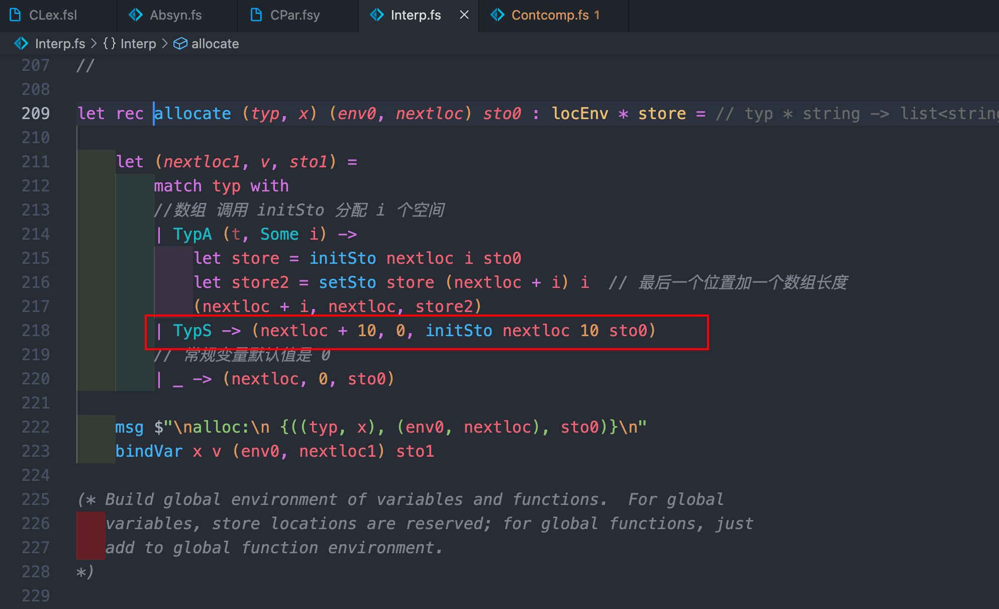

# 2021-2022 学年第 2 学期实验报告


- 课程名称：编程语言原理与编译
- 实验项目：期末大作业
- 专业班级：计算机 1901
- 学生学号：31901010
- 学生姓名：陈立
- 实验指导教师：郭鸣

### 成员分工说明

| 姓名 | 学号     | 班级        | 任务                         | 权重 |
| ---- | -------- | ----------- | ---------------------------- | ---- |
| 陈立 | 31901010 | 计算机 1901 | 解释器编译器代码、测试、文档 | 1.0  |

成员代码提交日志

//TODO 图片

### 项目自我评估表

| 解释器             | 评分 (1-5) | 备注                                         |
| ------------------ | ---------- | -------------------------------------------- |
| ++ -- 算法操作符   | 5          | 支持 i++ ++i                                 |
| += -= 等赋值运算符 | 5          |                                              |
| 三目运算符         | 5          |                                              |
| 注释 (*  *)        | 5          | token 解析阶段，与解释和编译无关             |
| 变量初始化         | 5          | 支持全局                                     |
| max min abs        | 5          |                                              |
| string 类型        | 4          | 固定长度                                     |
| print 字符串       | 5          | prints 输出字符串类型变量或者字符串          |
| for                | 5          | for (expr; expr; expr) stmt                  |
| for in range       | 5          | 实现 python for in range 语法                |
| switch             | 4          | 无法实现语句块；defalut 必须在所有 case 之后 |
| 检查数组下标越界   | 5          | 判断数组下标是否越界                         |

| 编译器             | 评分 (1-5) | 备注                             |
| ------------------ | ---------- | -------------------------------- |
| ++ -- 算法操作符   | 5          | 支持 i++ ++i                     |
| += -= 等赋值运算符 | 5          |                                  |
| 三目运算符         | 5          |                                  |
| 注释 (*  *)        | 5          | token 解析阶段，与解释和编译无关 |
| 变量初始化         | 5          | 支持全局                         |
| max min abs        | 5          |                                  |
| for                | 5          | for (expr; expr; expr) stmt      |
| for in range       | 5          | 实现 python for in range 语法    |
| switch             | 4          | 无法实现语句块；职责链践行       |

### 项目说明

#### 概述

本项目基于 microc 进行改进，从词法语法分析到中间代码最终的机器代码生成优化，使 gcc 编译器和 python 解释器名词变得不再陌生。项目主要对原有项目缺少的功能使用 F# 语言实现相应的解释器和编译器代码，从而进一步理解与运用编译原理的知识。最终 microc 支持变量初始化（全局）、支持算术、赋值等操作符，使其支持更简洁的方式修改变量的值，支持 math 库中常用的取最大值、最小值和绝对值表达式，支持字符串新类型及字符串的输出，支持 for、switch 循环分支新语法，支持对数组越界的检测。

#### 目录结构

```sh
.
├── cmd             # 自动化运行脚本
├── docs            # 文档
├── example         # 测试样例
├── Absyn.fs        # 抽象语法
├── CLex.fsl        # 词法定义
├── CPar.fsy        # 语法定义
├── Interp.fs       # 解释器
├── Parse.fs        # 语法解析器
├── interpc.fsproj  # 解释器项目文件
├── Contcomp.fs     # 优化编译器
├── Machine.cs      # 栈式虚拟机
├── Machine.fs      # 指令集定义
├── microcc.fsproj  # 优化编译器项目文件
├── machine.c       # c 虚拟机
└── machine.csproj  # 虚拟机项目文件
```

#### 构建与运行（Unix /bin/bash）

由于构建运行过程一个文件需要运行多条命令，因此编写一个自动运行脚本的 bash 脚本，实现了获取文件名、支持任意长度参数和运行结果输出到文件。运行命令 `bash cmd/run.sh <relative_path>`

```bash
#!/bin/bash
root_path="/Users/chenli/Documents/Course/GThree/compile/final/microc/"
bin_path=$root_path"bin/Debug/net6.0"
ex_name=${1%.*}  # 去后缀

# 切换目录
cd $root_path
dotnet clean interpc.fsproj
dotnet run --project interpc.fsproj -g $ex_name.c ${@:2} > cmd/interpc_g.txt
$bin_path/interpc $ex_name.c ${@:2} > cmd/interpc.txt

dotnet clean microcc.fsproj
dotnet run --project microcc.fsproj $ex_name.c

dotnet clean machine.csproj
dotnet run --project machine.csproj -t $ex_name.out ${@:2} > cmd/machine_t.txt
$bin_path/machine $ex_name.out ${@:2} > cmd/machine.txt
```

### 功能实现

#### 自增自减

- 实现 `i++` `++i` `i--` `--i` 算术运算符

- 测试样例 (example/ex_incdec.c)

  ```c
  // micro-C example Increment/Decrement Operator
  
  void main() {
      int i;
      i = 5;
      print i++;
      i = 5;
      print ++i;
      i = 5;
      print i--;
      i = 5;
      print --i;
  }
  ```

- 测试结果

  解释器运行结果

  

  Token 序列、抽象语法树

  

  编译器运行结果

  

  栈式虚拟机堆栈

  

#### 赋值运算符

- 实现 `-=` `+=` `/=` `*=` `%=` 赋值运算符

- 测试样例 (example/ex_primassign.c)

  ```c
  // micro-C example Assignment Operator
  // 0 1 0 5 10 5 1
  
  void main() {
      int i;
      i = 0;
      print i;
      i += 1;
      print i;
      i -= 1;
      print i;
      i = 5;
      print i;
      i *= 2;
      print i;
      i /= 2;
      print i;
      i %= 2;
      print i;
  }
  ```

- 测试结果

  解释器运行结果

  

  Token 序列、抽象语法树

  

  编译器运行结果

  

  栈式虚拟机堆栈

  

#### 三目运算符

- 实现 `条件 ? 结果1 : 结果2`

- 测试样例 (example/ex_prim3.c)

  ```c
  // micro-C example Increment/Decrement Operator
  
  void main() {
      int i = 1 > 0 ? 1 : 0;
      print i;
  }
  ```

- 测试结果

  解释器运行结果

  

  Token 序列、抽象语法树

  

  编译器运行结果

  

  栈式虚拟机堆栈

  

#### 数学表达式

- 实现 `max(i, j)` `min(i, j)` `abs(i)`

- 测试样例 (example/ex_maxminabs.c)

  ```c
  // micro-C example max min abs
  
  void main() {
      int i;
      int j;
      i = 5;
      j = -3;
      print max(i, j);
      print min(i, j);
      print abs(j);
  }
  ```

- 测试结果

  解释器运行结果

  

  Token 序列、抽象语法树

  

  编译器运行结果

  

  栈式虚拟机堆栈

  

  

#### string 类型及 pirnt 打印

- 实现 `string` 新类型和 `prints` 输出字符串

- 测试样例 (example/ex_maxminabs.c)

  ```c
  // micro-C example string
  
  void main() {
      string s;
      s = "microc\n";
      prints s;
      prints "microcc\n";
  }
  ```

- 测试结果

  解释器运行结果

  

  Token 序列、抽象语法树

  

#### 变量初始化（支持下划线命名法、`(*  *)` 注释）

- 实现 `Type i = Expr` 全局与局部初始化

- 测试样例 (example/ex_varassign.c) **编译器不支持注释部分**

  ```c
  // micro-C example var assign
  
  int glo_i = 1;
  // string glo_s = "s1";
  int glo_ii = glo_i + 1;
  
  void main() {
      // prints "glo_i: ";
      print glo_i;
      // prints "\nglo_ii: ";
      print glo_ii;
      int loc_i = 3;
      // prints "\nloc_i: ";
      print loc_i;
    	(* print (glo_i + 999); *)
  
      // prints "\nglo_s: ";
      // prints glo_s;
      // int loc_s = "s2";
      // prints "\nloc_s: ";
      // prints loc_s;
  }
  ```

- 测试结果

  解释器运行结果

  

  Token 序列、抽象语法树

  

  编译器运行结果

  

  栈式虚拟机堆栈

  

#### for

- 实现 `for (i; i < n; i++)`

- 测试样例 (example/ex_for.c)

  ```c
  // micro-C example Increment/Decrement Operator
  
  void main(int n) {
      int i;
      for (i = 0; i < n; i++) {
          print i;
      }
  }
  ```

- 测试结果

  解释器运行结果

  

  Token 序列、抽象语法树

  

  编译器运行结果

  

  栈式虚拟机堆栈（其它几次循环与此类似）

  

#### for in range

- 实现 `for access in range(expr) stmt` `for access in range(expr, expr) stmt` `for access in range(expr, expr, expr) stmt`

- 测试样例 (example/ex_forrange1.c)

  ```c
  // micro-C example ForRange1
  
  void main() {
      int i;
      for i in range(5) {
          print i;
      }
  }
  ```

- 测试结果

  解释器运行结果

  

  Token 序列、抽象语法树

  

  编译器运行结果

  

  栈式虚拟机堆栈（其它几次循环与此类似）

  

- 测试样例 (example/ex_forrange2.c)

  ```c
  // micro-C example ForRange2
  
  void main() {
      int i;
      for i in range(5, 10) {
          print i;
      }
  }
  ```

- 测试结果

  解释器运行结果

  

  Token 序列、抽象语法树

  

  编译器运行结果

  

  栈式虚拟机堆栈（其它几次循环与此类似）

  

- 测试样例 (example/ex_forrange3.c)

  ```c
  // micro-C example ForRange3
  
  void main() {
      int i;
      for i in range(1, 10, 2) {
          print i;
      }
  }
  ```

- 测试结果

  解释器运行结果

  

  Token 序列、抽象语法树

  

  编译器运行结果

  

  栈式虚拟机堆栈

  

#### switch

- 实现 `switch case default`

- 测试样例 (example/ex_switch.c)

  ```c
  // micro-C example Switch
  
  void main(int n) {
      switch (n) {
      case 0:
          print 0;
      case 1:
          print 1;
      case 2:
          print 2;
      default:
          print 999;
      }
  }
  ```

- 测试结果

  解释器运行结果

  Token 序列、抽象语法树

  

  编译器运行结果

  

  栈式虚拟机堆栈（核心构建“标签链”）

  

#### 检查数组下标越界

- 实现 

- 测试样例 (example/ex_arrayerror.c)

  ```c
  // micro-C example array index out of size
  
  void main() {
      int i[5];
      print i[6];
  }
  ```

- 测试结果

  解释器运行结果

  

  Token 序列、抽象语法树

  

### 解决技术要点说明

#### switch case

- `CLex.fsl` 中定义关键字 switch case default，使扫描器能扫到这 3 个字符串的时候转换成 SWITCH CASE DEFAULT

  

- `Absyn.fs` 抽象语法中定义 Switch 语句，因为 Switch 由若干个 case 和一个 default 组成，所以需要定义一个新的语句类型 stmts，使 Case 的类型为 expr * stmt、Default 的类型为 stmt、 Switch 类型为 expr * stmts list

  

- 首先在 `CPar.fsy` 中定义 SWITCH CASE DEFAULT 3 个 Token

  

  然后在 StmtM 语句中定义具体的语法 Token 位序，并传具体参数到抽象语法中，同时需要定义新语句类型 StmtS 中的 Case 和 Default 的具体语法，返回一个的数组

  

- **解释器实现（难点：递归函数构造）**

  `Interpc.fs` 即解释器，实现对 Switch 抽象语法，e 是表达式使用 eval 计算获取对应值，body 是一个 list，因此需要编写一个递归函数遍历 list。并匹配若是 Case 语句取他表达式 e1 的值，与 e 的值进行比较，不相等继续遍历下一个语句，若 Default 语句直接执行 body 语句，要求 Default 语句需在所有 Case 语句之后

  

  **编译器实现（难点：label 链表构造）**

  核心构建一条 label 的链表，通过递归，先获取下一条的 label，然后将其设置在 Case 语句判断是否相等的运算之后，若不相等则跳转到下一条 Case 或 Default 语句 label，有点职责链的样子

  

#### 变量初始化（全局）

- 无需新关键字创建，直接在 `Absyn.fs` 在顶级声明 (topdec) 中定义全局变量初始化 VardecAssign 抽象语法，在语句和定义 (stmtordec) 中定义 DecAssign 抽象语法

  

- 同理在 `CPar.fsy` 定义两者的具体语法，需要先定义一个变量初始化的 Token 位序，然后用于两个抽象语法的具体 Token 位序规则编写

  

  

  

- **解释器实现（难点：全局初始化）**

  由于原始代码的初始化放太前，导致 eval 无法使用，因此将其移到下方，并根据 gloEnv 的定义从 locEnv1 元组取第一个元素作为 gloEnv 的第一个元素，取 funEnv 作为 gloEnv 的第二个元素，最终实现修改赋值作用（修改环境和 store）

  

  **编译器实现**

  与解释器类似

  

#### string 类型

- 和前面一样在词法分析、抽象语法、语法分析加入相应的内容，不同的在于语法分析中的定义，需要定义一个 ConstS 包含字符串的表达式并定义到 AtExprNotAccess 中

  

- **解释器实现**

  核心在于字符串的定义，由于栈内存储连续性，导致扩容没有那么容易，浅尝辄止……（默认定义 10 个长度，初始化都为 0）

  

- 赋值操作，即找到变量 acc 的地址，检测到他是字符串时，获取字符串长度进行 for setStore 修改数组前 s.Length 元素上的值，返回字符串长度

  

- prints 在 Prim1 的表达式实现中，原理和赋值相反，输出是遍历获取对应长度上的值，并转化成 string 类型拼接到字符串 str，最后打印（字符串常量同理）

  

#### 检查数组下标越界

- microc 在实现功能的同时也应具有代码的健壮性，实现了检查数组下标是否越界的功能。原始代码没有数组长度能直接获取，才导致无法对下标越界操作进行处理，因此需要从申请空间为起点进行修改，添加一个存储数组长度的存储单元，位于数组的最后一个的后一个位置

  

- 在取数组下标值时取出最后一个值即长度进行判断

  

#### 踩过的坑

- fst snd 只针对 2 个元素的元组有效
- 只支持花括号语句块，switch 语句只能放一个 expr
- switch body 的 list 拼接不能用 `::`

### 心得体会

#### 大项目开发过程心得

上来先总结，整个大作业过程循序渐进，凡事开头难。从项目刚建立之初到最终完成的这段时间内，git 记录可以清晰表明完成速度是越来越快。当一开始拿到这份原始工程时，连运行都会出错，当把为什么出错解决之后发现 clean 后 run，再加上之后很多的测试样例是一件很麻烦的事，基于之前的 bash 脚本编写基础写了一个简易的自动化运行脚本，奠定了之后舒服开发流程。

虽然有两三个学长的参考项目，但是刚上手连这些文件分别充当了什么作用都不清楚。通过有用的对比分析法则，我快速定位了哪些文件是需要编辑的，先对解释器进行攻克，模仿原始项目的代码实现了一个自增自减后，理解了 expr、stmt、store、locEnv 等含义，对总体框架有了基本了解后写赋值运算符就变得十分的迅速，甚至一次即成功。当实现变量初始化时，发现学长们学长们都没有实现全局初始化的功能，想着不就一个 set 值嘛有这么难吗，没想到 eval 没有定义，gloEnv 不存在，那需要解决的问题很明确了，难的还是把 gloEnv 构造出来，看了 run 中 gloEnv 组成才和 gloEnv 类型定义才成功实现的全局初始化，这可能也是为什么需要有后人的原因吧哈哈。

整个项目最难的还是优化编译器部分，看完解释器后取看编译器，完全看不懂，愣是把我看了 2 天，在不断的尝试下学会了如何调试，对着指令集和栈式虚拟机运行的活动记录栈反复看，终于理解了 C 续算的实用性，这其中的两个困难分别是对 F# 语法和汇编语言的不熟悉，导致“开个门”都用了很久时间。优化编译器编写属实让我感受到了函数式编程之美和逆向写代码（可能实际还是正向思考）一气呵成之爽，没有解释器偏向于声明式编程那么繁琐，这也必定带来不同的编程思维，一个大作业学会两种方式值。

编译原理大作业虽然只是完成了几个简单的语法，对解释器和编译器知道了一个大致流程，但已经可以想象到语言特性实现出来的难度了，如可变长度的变量实现、switch 代码块的实现等无法实现。恍然大悟，郭老师推崇”道法术“中的前二者是多么的正确，只有最基础底层的知识才是最有用的，万变不离其宗。

#### 本课程建议

- 课程难度

  果然是压轴必修课，是所有计算机课程中最难理解，也最抽象的一块知识点，课上听课课后作业都需要花费不少时间理解并运行实现，一边被虐一边爱它，虐的是难度，爱的是全新未知领域，全新的语言加全新的理论。有时会让我产生对自己计算机能力的怀疑，但经过这次磨练势必巨大收获。唯一一个缺点就是难。

- 课程内容

  不得不说，郭老师的课是计算学院具有新颖教学内容的极少数课程之一。第一，编译原理的核心内容的讲解使我对编译从词法分析、语法分析到机器代码生成整个过程有了个基本的框架。第二，不同于其它老师的“课后练习”，编译原理的课后练习都是围绕最终目的 microc 的实现做铺垫，同时也不是简单的实现，其中会有阅读和思考。

- 授课方式

  与课程内容相同，授课方式也十分新颖。首先给我们学生看的讲义都是老师自己的搭的博客，课后我们可以反复查看，这博客还让我了解到原来搭建一个文档网站只需“一行命令”，可以见识到很多新颖的技术。授课过程中会对难理解的部分反复强调，还会给一些可视化网站有助于我们理解。

  
