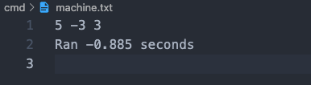
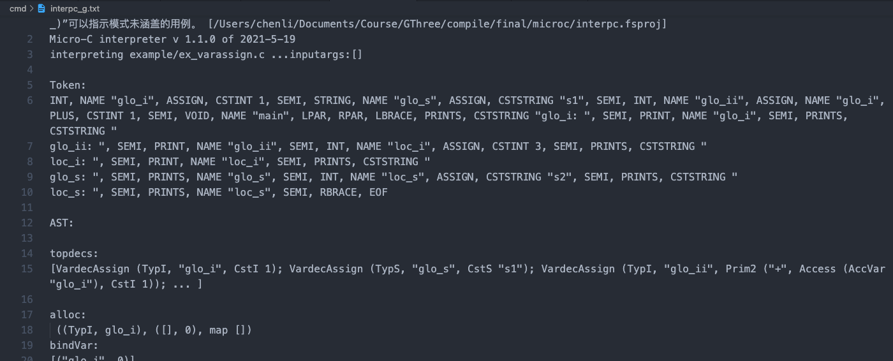
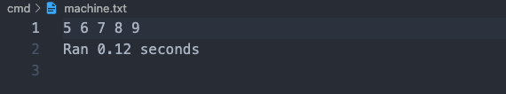

# 2021-2022 学年第 2 学期实验报告


- 课程名称：编程语言原理与编译
- 实验项目：期末大作业
- 专业班级：计算机 1901
- 学生学号：31901010
- 学生姓名：陈立
- 实验指导教师：郭鸣

### 成员分工说明

| 姓名 | 学号     | 班级        | 任务                         | 权重 |
| ---- | -------- | ----------- | ---------------------------- | ---- |
| 陈立 | 31901010 | 计算机 1901 | 解释器编译器代码、测试、文档 | 1.0  |

成员代码提交日志

//TODO 图片

### 项目自我评估表

| 解释器             | 评分 (1-5) | 备注                                |
| ------------------ | ---------- | ----------------------------------- |
| ++ -- 算法操作符   | 5          | 支持 i++ ++i                        |
| += -= 等赋值运算符 | 5          |                                     |
| 三目运算符         | 5          |                                     |
| 注释 (*  *)        | 5          | token 解析阶段，与解释和编译无关    |
| 变量初始化         | 5          | 支持全局                            |
| max min abs        | 5          |                                     |
| string 类型        | 4          | 固定长度                            |
| print 字符串       | 5          | prints 输出字符串类型变量或者字符串 |
| for                | 5          | for (expr; expr; expr) stmt         |
|                    |            |                                     |

| 编译器             | 评分 (1-5) | 备注                             |
| ------------------ | ---------- | -------------------------------- |
| ++ -- 算法操作符   | 5          | 支持 i++ ++i                     |
| += -= 等赋值运算符 | 5          |                                  |
| 三目运算符         | 5          |                                  |
| 注释 (*  *)        | 5          | token 解析阶段，与解释和编译无关 |
| 变量初始化         | 5          | 支持全局                         |
| max min abs        | 5          |                                  |
| for                | 5          | for (expr; expr; expr) stmt      |

### 项目说明

#### 概述

本项目基于 microc 进行改进，从词法语法分析到中间代码最终的机器代码生成优化，使 gcc 编译器和 python 解释器名词变得不再陌生。项目主要对原有项目缺少的功能使用 F# 语言实现相应的解释器和编译器代码，从而进一步理解与运用编译原理的知识。最终 microc 支持变量初始化（全局）、支持算术、赋值等操作符，使其支持更简洁的方式修改变量的值，支持 math 库中常用的取最大值、最小值和绝对值表达式，支持字符串新类型及字符串的输出，支持 for、switch、do while 等循环分支新语法，支持对数组越界的检测。

#### 目录结构

```sh
.
├── cmd             # 自动化运行脚本
├── docs            # 文档
├── example         # 测试样例
├── Absyn.fs        # 抽象语法
├── CLex.fsl        # 词法定义
├── CPar.fsy        # 语法定义
├── Interp.fs       # 解释器
├── Parse.fs        # 语法解析器
├── interpc.fsproj  # 解释器项目文件
├── Contcomp.fs     # 优化编译器
├── Machine.cs      # 栈式虚拟机
├── Machine.fs      # 指令集定义
├── microcc.fsproj  # 优化编译器项目文件
├── machine.c       # c 虚拟机
└── machine.csproj  # 虚拟机项目文件
```

#### 构建与运行（Unix /bin/bash）

由于构建运行过程一个文件需要运行多条命令，因此编写一个自动运行脚本的 bash 脚本，实现了获取文件名、支持任意长度参数和运行结果输出到文件。运行命令 `bash cmd/run.sh <relative_path>`

```bash
#!/bin/bash
root_path="/Users/chenli/Documents/Course/GThree/compile/final/microc/"
bin_path=$root_path"bin/Debug/net6.0"
ex_name=${1%.*}  # 去后缀

# 切换目录
cd $root_path
dotnet clean interpc.fsproj
dotnet run --project interpc.fsproj -g $ex_name.c ${@:2} > cmd/interpc_g.txt
$bin_path/interpc $ex_name.c ${@:2} > cmd/interpc.txt

dotnet clean microcc.fsproj
dotnet run --project microcc.fsproj $ex_name.c

dotnet clean machine.csproj
dotnet run --project machine.csproj -t $ex_name.out ${@:2} > cmd/machine_t.txt
$bin_path/machine $ex_name.out ${@:2} > cmd/machine.txt
```

### 功能实现

#### 自增自减

- 实现 `i++` `++i` `i--` `--i` 算术运算符

- 测试样例 (example/ex_incdec.c)

  ```c
  // micro-C example Increment/Decrement Operator
  
  void main() {
      int i;
      i = 5;
      print i++;
      i = 5;
      print ++i;
      i = 5;
      print i--;
      i = 5;
      print --i;
  }
  ```

- 测试结果

  解释器运行结果

  

  Token 序列、抽象语法树

  

  编译器运行结果

  

  栈式虚拟机堆栈

  

#### 赋值运算符

- 实现 `-=` `+=` `/=` `*=` `%=` 赋值运算符

- 测试样例 (example/ex_primassign.c)

  ```c
  // micro-C example Assignment Operator
  // 0 1 0 5 10 5 1
  
  void main() {
      int i;
      i = 0;
      print i;
      i += 1;
      print i;
      i -= 1;
      print i;
      i = 5;
      print i;
      i *= 2;
      print i;
      i /= 2;
      print i;
      i %= 2;
      print i;
  }
  ```

- 测试结果

  解释器运行结果

  

  Token 序列、抽象语法树

  

  编译器运行结果

  

  栈式虚拟机堆栈

  

#### 三目运算符

- 实现 `条件 ? 结果1 : 结果2`

- 测试样例 (example/ex_prim3.c)

  ```c
  // micro-C example Increment/Decrement Operator
  
  void main() {
      int i = 1 > 0 ? 1 : 0;
      print i;
  }
  ```

- 测试结果

  解释器运行结果

  

  Token 序列、抽象语法树

  

  编译器运行结果

  

  栈式虚拟机堆栈

  

#### 数学表达式

- 实现 `max(i, j)` `min(i, j)` `abs(i)`

- 测试样例 (example/ex_maxminabs.c)

  ```c
  // micro-C example max min abs
  
  void main() {
      int i;
      int j;
      i = 5;
      j = -3;
      print max(i, j);
      print min(i, j);
      print abs(j);
  }
  ```

- 测试结果

  解释器运行结果

  

  Token 序列、抽象语法树

  

  编译器运行结果

  

  栈式虚拟机堆栈

  

  

#### 变量初始化（支持下划线命名法、`(*  *)` 注释）

- 实现 `Type i = Expr` 全局与局部初始化

- 测试样例 (example/ex_varassign.c) **编译器不支持注释部分**

  ```c
  // micro-C example var assign
  
  int glo_i = 1;
  // string glo_s = "s1";
  int glo_ii = glo_i + 1;
  
  void main() {
      // prints "glo_i: ";
      print glo_i;
      // prints "\nglo_ii: ";
      print glo_ii;
      int loc_i = 3;
      // prints "\nloc_i: ";
      print loc_i;
    	(* print (glo_i + 999); *)
  
      // prints "\nglo_s: ";
      // prints glo_s;
      // int loc_s = "s2";
      // prints "\nloc_s: ";
      // prints loc_s;
  }
  ```

- 测试结果

  解释器运行结果

  

  Token 序列、抽象语法树

  

  编译器运行结果

  

  栈式虚拟机堆栈

  

#### for

- 实现 `for (i; i < n; i++)`

- 测试样例 (example/ex_for.c)

  ```c
  // micro-C example Increment/Decrement Operator
  
  void main(int n) {
      int i;
      for (i = 0; i < n; i++) {
          print i;
      }
  }
  ```

- 测试结果

  解释器运行结果

  

  Token 序列、抽象语法树

  

  编译器运行结果

  

  栈式虚拟机堆栈（其它几次循环与此类似）

  

#### for in range

- 实现 `for access in range(expr) stmt` `for access in range(expr, expr) stmt` `for access in range(expr, expr, expr) stmt`

- 测试样例 (example/ex_forrange1.c)

  ```c
  // micro-C example ForRange1
  
  void main() {
      int i;
      for i in range(5) {
          print i;
      }
  }
  ```

- 测试结果

  解释器运行结果

  

  Token 序列、抽象语法树

  

  编译器运行结果

  

  栈式虚拟机堆栈（其它几次循环与此类似）

  

- 测试样例 (example/ex_forrange2.c)

  ```c
  // micro-C example ForRange2
  
  void main() {
      int i;
      for i in range(5, 10) {
          print i;
      }
  }
  ```

- 测试结果

  解释器运行结果

  

  Token 序列、抽象语法树

  

  编译器运行结果

  

  栈式虚拟机堆栈（其它几次循环与此类似）

  

- 测试样例 (example/ex_forrange3.c)

  ```c
  
  ```

- 测试结果

  解释器运行结果

  

  Token 序列、抽象语法树

  

  编译器运行结果

  

  栈式虚拟机堆栈

  

#### 

- 实现 

- 测试样例 (example/ex_.c)

  ```
  
  ```

- 测试结果

  解释器运行结果

  

  Token 序列、抽象语法树

  

  编译器运行结果

  

  栈式虚拟机堆栈

  

#### 


### 解决技术要点说明

- 踩过的坑
  - fst snd 只针对 2 个元素的元组有效

### 心得体会

#### 大项目开发过程心得


#### 本课程建议
